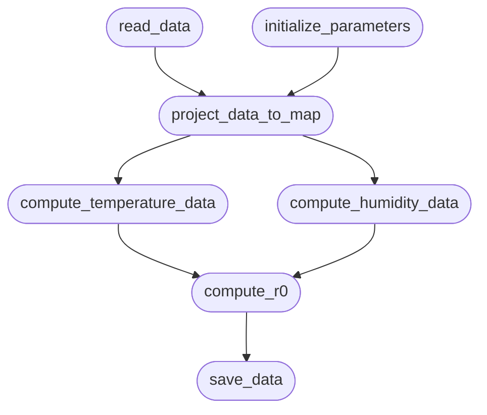

# Basic design of model implementations

## Principles
There are two basic design principles on which all models in this package are built: 
- **functional programming**: You write and compose **functions**, not just statements. If you wish to know more about different programming paradigms, see [here](https://www.geeksforgeeks.org/system-design/introduction-of-programming-paradigms/), and if you want an introduction to functional programming in itself, see [here](https://www.tutorialspoint.com/functional_programming/index.htm). Functional programming is a natural way of composing dynamical systems, and alleviates the model designer from having to deal with a lot of the intricacies of object-orientation in python. Most of all, however, it lends itself well to automated system composition, i.e., we can automatically build a directed acyclic graph of functions, in which any given function can depend on the result of a number of predecessors and itself be a dependency of a number of other functions.

- **Separation of parameterization and functionality**: This means that you write the model code in the form of a collection of functions, and parameterize it in accordance with th real world system you want to model. But instead of supplying the parameters and control flow in the code directly, you write a configuration file that defines and provides them. This helps us in multiple ways: 
    - Separation of concerns: Code is for model functionality, config files are for definition of a certain model instance. You can run a model without any changes to the code by just changing the parameters in the supplied config file. This also allows us to easily build different versions of the same model by providing multiple configuration files which define a different composition of the functions that make up the model. 
    - Documentation and reproducibility: The configuration file used to run a model can be stored alongside the data it produces, so it's automatically documented which parameters produced which results, and what functional composition was utilized. 

## Directed acyclic graphs for model composition from functions 
Each model is implemented as a collection of functions, which within the python files are not connected into a running model. They can, however, be made up of calls to other functions. 
For example, a model might consist of functions:
    - `read_data`
    - `initialize_parameters`
    - `project_data_to_map`
    - `compute_temperature_data`
    - `compute_humidity_data`
    - `compute_r0`
    - `save_data`

When we think about how these functions interact to form the fully-fledged model, we arrive at a web of interdependencies with clear definition of which function depends on which others. This lets us reason about model composition by considering how data flows through the functions: 

For example, this could look like this: 
- `read_data` does not depend on any other function. It is a `source` of data.
- `initialize_parameters` does not depend on any other functions as well, so it, too, is a `source` of data. 
- `project_data_to_map` depends on `read_data` and `initialize_parameters` 
- `compute_temperature_data` depends on `project_data_to_map`
- `compute_humidity_data` depends on `project_data_to_map`
- `compute_r0` depends on humidity and temperature at any given grid point, so it depends on both `compute_humidity_data` and `compute_temperature_data`. 
- finally, `save_data` depends on `compute_r0`. No further function depends on `save_data`, so it is a `sink` for the produced data.

This set of interdependencies creates a graph in which each node is a function and each edge tells us on which other functions it depends. For clarity, we usually turn these edges around and interpret them as telling us to what other functions data flows from any given function. 
Consider the image below to see a visualization of this system: 



As can be seen, there are multiple `levels` in this system. The functions within a level are independent *from each other* (but can have the same or overlapping dependencies). This means that the functions on the same level can be run in parallel. 
This system can be serialized into a dictionary-like datastructure: 

```yaml
    source1: 
        function_name: read_data
        input: [] # none because sink
    source2: 
        function_name: initialize_parameters
        input: [] # none because sink 
    project_data: 
        function_name: project_data_to_map
        input: [source1, source2]
    compute_temp: 
        function_name: compute_temperature_data 
        input: [project_data]
    compute_humidity: 
        function_name: compute_humidity_data
        input: [project_data]
    compute_r0_values: 
        function_name: compute_r0
        input: [compute_temp, compute_humidity]
    sink: 
        function_name: save_data
        input: [compute_r0_values]
```

`heiplanet-models` uses the powerful [dask](https://www.dask.org/) package to set up and run these directed acyclic graphs (DAG), and automatically parallelize them where possible (e.g., the ones on the same level in the DAG), depending on the process scheduler we ask it to use. 
Therefore, `heiplanet-models` is only responsible for processing a given configuration file that a model as such a graph into a `dask` graph, and then it can be exported, run with different parameters, visualized and much more.


## Configuration files 
In order to use an existing model, you don't have to write any code - you just have to use provide a config file that defines how the functions that make up the model are tied together into a directed acyclic graph that defines the model execution. 

`heiplanet-models` defines a standardized structure for this purpose, and each model comes with a default configuration file that provides a runable baseline implementation. 

Configuration files are written in JSON, which is a basic, human readable file format that works much like python dictionaries mapping strings to collections of strings. These mappings can be nested, much like a dictionary can store other dictionaries. 


### Execution graph
The first part we need to know about is the definition of the execution graph of the model. Graphs are made up of nodes and edges. in `heiplanet-models` nodes are defined explicitly, and edges are defined by telling each node what its input nodes are, so there is no separate structure to define edges. 

Each node has a name, and defines the function to execute, from which module file it is from, and on which other functions it depends: 

```json 
"nodename": {
    "function": "function_name",
    "module": "./module_filename",
    "input": ["input_one", "input_two"],
}
```
The collection of nodes defined in this way will give us the entire graph structure, stored in the 'graph' node of the json configuration file. This could look like this: 

```json 
"graph": {
    "setup": {
        "function": "setup_parameters",
        "module": "path/to/module/where/setup_parameters/is/defined",
        "input": [],
    },
    "compute1": {
        "function": "compute_something",
        "module": "path/to/module/where/compute_something/is/defined",
        "input": ["setup"],
    }, 
    "compute2": {
        "function": "compute_something_else",
        "module":  "path/to/module/where/compute_something_else/is/defined",
        "input": ["setup", "compute1"]
    }, 
    "save": {
        "function": "save_data", 
        "module": "path/to/module/where/save_data/lives", 
        "input": ["compute2"]
    }
}
```
A limitation of the graph structure and usage of dask is that each model graph **must have one and only one sink node**. It can, however, have arbitrarily many source nodes. Also note that **all model graphs must be directed and acyclic**, so a graph that contains loops will not work correctly and likely lead to a silent deadlock. 

### Possible function signatures and limitations
Because of the interdependency structure of the data, it is always assumed that the **first n arguments to each function are the output of its dependencies, in the order defined in the configuration!**
For example, in the above configuration, the function `compute2` would have the 
following basic signature. 

```python 
def compute_something_else(output_of_setup, output_of_compute_something): 
    ... 
```

The first argument here is the output of the `setup` function, the second is the output of the `compute_something` function.

This doesn't mean that a function cannot have more arguments or keyword arguments. `heiplanet-models` does support arbitrary further args and kwargs, which, however **must be fixed and given in the config**. This means that for the `compute_something_else` function, it could have, for example, the following signature:

```python 
def compute_something_else(output_of_setup, output_of_compute_something, arg1, arg2, arg3, kwarg1=k1, kwarg2=k2): 
    ... 
```
In the configuration file, these additional parameters to the function are given under the `args` and `kwargs` entries in each function node: 

```json 
    "compute2": {
        "function": "compute_something_else",
        "module":  "path/to/module/where/compute_something_else/is/defined",
        "input": ["setup", "compute1"], 
        "args": ["arg1", "arg2", "arg3"],
        "kwargs": {
            "kwarg1": "k1", 
            "kwarg2": "k2"
        }
    }, 
```
Note that each function node in the config file **must have the nodes [function, module, input, args, kwargs] defined, even if they are empty**. This is in keeping with Python's basic concept of 'explicit is better than implicit'.  
To see a real world example of a configuration file, have a look at the documentation of the [jmodel](./jmodel.md). 

### Defining execution scheduler and log levels
In addition to the structure of the computational graph of the model and the fixed args and kwargs of each function, we also need to tell the package how to execute the graph, and possibly the amount of logging output we want. 
This is done not in the `graph` definition, but in a separate configuration node called `execution`: 
```json 
"exectution": {
    "scheduler": "scheduler_definition",
    "log_level": "info"
}
```
Possible schedulers are defined by dask, and can be given with the following keywords: 
- "synchronous": Runs the computation graph sequentially, no parallelization is happening
- "threads": Uses threads for asynchronous execution of the computation graph. Note that this can be subject to the python global interpreter lock, so it's generally not recommended for optimal parallel performance. 
- "multiprocessing": Uses multiple processes for parallelization, as opposed to threads. this is not subject to the global interpreter lock. This achieves parallelization on one machine across cores.  
- "distributed": Parallel execution on a multi-machine cluster. Not supported yet, and untested.


## Summary 
You now have a comprehensive understanding of how `heiplanet-models` works, which should set you up to readily proceed to the 'Using existing models' section. 