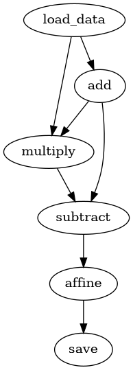

# Customize or create new models 
This section will introduce you to the process of creating a new model. 

## Principles and mental model
As discussed in [the basic design section](./basic_design.md) `heiplanet-models` is based on functional programming. This means, that each model is just a set of functions that can be stacked together in such ways as their signatures allow. Much like in a kid's construction kit, as long as the blocks fit togther, you can build whatever you want by stacking them together in differen ways. The 'blocks' here are the individual functions, the 'stacking together' is tieing them together into a computational graph that defines the data flow through the software, and thus the system that is modeled. Hence, `heiplanet` models are inherently modular and composed of reusable components. 
Additionally, this approach makes it easy to build many versions of the same model by just changing a desired function in the graph.

When building a new model, before diving into writing any code, it is therefore useful to adopt this network-based mental model (actually, many useful dynamical systems can be thought of as [finite state automatons](https://en.wikipedia.org/wiki/Finite-state_machine), graphs in which nodes represent system states and edges represent transitions between them). 
In particular, this means: 

- decide on the number and character of states in your model 
- decide on the transitions between them and their nature. 
- after you have come up with these, decide on how they have to fit together, such that you end up with a first graph representation of the model 
- then check if you can simplify it :) 

The same principle holds for customizing existing models, but we start out with an existing graph. 

## Writing the code
As mentioned, the actual model code just consists of a set of python functions. 
Functions represent transitions between different states of the model, hence the input of a function represents one model state and the output another. 
How this model state is defined is not important for `heiplanet`, but is an implementation detail you can decide on. Consequently, the function signatures are also implementation details and you can freely decide what they should be. 
Each function needs to accept the input of its predecessors though, and outputs something its successors must accept. Each of these steps can itself be composed of other function calls, contain closures or other language constructs.

Write your functions according to the model specifications and ideally add some unit tests to make sure each one works as expected. 
Make sure that the first input parameters correspond to its predecessor functions in the computational graph. All other parameters the function needs can follow as arguments or keyword arguments which can be specified in the config file.

All these functions need to be explicitly accessible from a single python file, whether by import or because they are directly defined therein. This is a basic assumption of the `heiplanet` system and **must not be violated**. Note that this does not preclude splitting your code into multiple modules internally, just provide a single module from which all relevant state changing functions of the model you are building are accessible. 

**That's it! There is no need to write any execution code yourself! The `computation_graph` object used to run the model will take care of creating this from the configuration. See [the section on using a model](./using_existing_models.md) if you need a recap**


## Restrictions 
In order ot make this work well, there need to be a couple of restrictions in place of how you should write your functional code. 

- As mentioned, make all the functions representing system states accessible through a single file. This might be something similar to a package `__init__.py` which just imports other modules, but they must be accessible from this file. 

- While not explicitly forbidden, functions that rely on side effects are discouraged. This can produce deadlocks when running a model in parallel, complicates the computation graph, and makes reasoning and debugging a lot harder.

- Assuming a function `C` has predecessors (input functions) `A`, `B` with output `a`, `b`, other parameters `x`, `y`, and keyword arguments with defaults `k = r`, `l=s`, the function signature should look like this: 

```python 
def C(a, b, x, y, k=r, l=s): 
    ... 
```

- As a restriction inherited from the way we use `dask`, each computational graph **must have a single, unique sink node** that all data flows into eventually. 
Note that this can be a virtual node as well that does nothing. It **must be present** however, because we use this node as the reference from which to set up the computation.


## Example 

Suppose we want to build a simple toy model that does some arithmetics. The model state is a vector of numbers, initially:

```csv 
idx,value
0,1
1,2
2,3
```
Let's call this `x = [1,2,3]`.

The model is the following: 

```math 
a = x + 2 
b = x * a 
c = a - b 
d = 5*c + 2 
```

The first line is an addition function with a fixed second summand of 2, the second is a multiplication of original data and the result of the addition, the third is a subtraction  of addition result and multiplication result and fourth is an affine transformation with offset 2 and slope 5. 

At this stage, the design phase is done: We know what states the model should have, what transformations it should undergo, and in what order and with which parameters these transformations should occur.

The functional code for each of these steps can look like this: 
```python

def add(x, y):
    return x + y


def multiply(x, y):
    return x * y


def subtract(x, y):
    return x - y


def affine(x, a=1, b=0):
    return a * x + b

```

Additionally, we need a data source, e.g., for loading the input data from csv:

```python 
def load_data(file_path):
    data = pd.read_csv(Path(file_path).resolve().absolute())
    return data["value"]  # return numpy array from the column 'value'
```

The `affine` transformation at the end is the data sink in this case, but we might want to add another one to store the transformed data back to disk: 

```python 
def save_data(data, file_path):
    data.to_csv(file_path, index=True)
```

This is the python code we need to write. Note how the arguments of the functions tie into each other.

In the next step, we specify the data flow and parameters for each function, as well as in which module to find it, in a configuration json file (or object, i.e., a dictionary): 

```python 
    graph_config = {
        "load_data": {
            "function": "load_data",
            "module": "./test/computation_module.py",
            "args": [
                "./test/computation_test_data.csv",
            ],
            "kwargs": {},
            "input": [],
        },
        "add": {
            "module": "./test/computation_module.py",
            "function": "add",
            "input": [
                "load_data",
            ],
            "args": [
                2,
            ],
            "kwargs": {},
        },
        "multiply": {
            "module": "./test/computation_module.py",
            "function": "multiply",
            "input": ["load_data", "add"],
            "args": [],
            "kwargs": {},
        },
        "subtract": {
            "module": "./test/computation_module.py",
            "function": "subtract",
            "input": ["add", "multiply"],
            "args": [],
            "kwargs": {},
        },
        "affine": {
            "module": "./test/computation_module.py",
            "function": "affine",
            "input": [
                "subtract",
            ],
            "args": [],
            "kwargs": {"b": 5, "a": 2},
        },
        "save": {
            "function": "save_data",
            "module": "./test/computation_module.py",
            "input": ["affine"],
            "args": [str("output.csv")],
            "kwargs": {},
        },
    }
```

Note the `args` and `kwargs` values in the config which fix the values of these parameters for the computation we want to have. 

Before building the computation graph and running the model, we need to complete the configuration with information about the desired run mode. We will use the placeholder `graph_config` to represent the above here, but this normally should be added in explicitly in a json file that stores the configuration. 

```python
config = {
    'graph': graph_config, 
    'execution': {
        'scheduler': 'synchronous' # synchronous schedule, no parallelization
    }, 
}
```

Finally, assuming this is available as an object `config` (e.g., loaded from disk), we can intantiate and visualize the computation: 

```python 
from heiplanet_models import computation_graph
computation = computation_graph(config)
computation.visualize()
```

Which should result in the following graph:



We can use this visualization to check if the data flow actually corresponds to our theoretical design from above. 

Finally, we can run the model:
```python
computation.execute()
```
which in this case will result in a file `output.csv` with the content `result = [5, -3, -15]`. 

